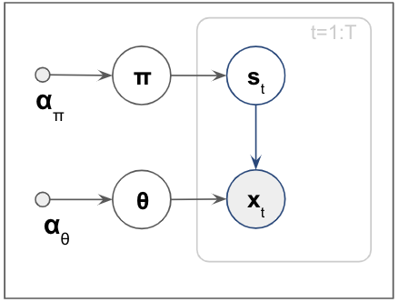
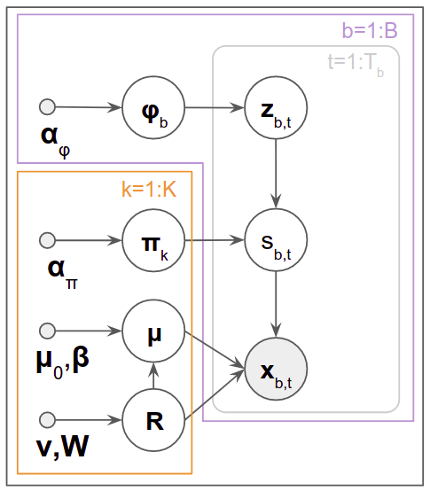

# Model of threat classification
## Overview
The goal of this model is to infer threat object types such as 'Bomb', 'Rifle' and 'No threat' from frequency responses in a Region of Interest (ROI). To achieve this goal, a model that is a combination of Latent Dirichlet Allocation (LDA) and Gaussian Mixture model (GMM) is introduced.

Each ROI contains several frequency responses that are from human body, part of cloths (zippers, buttons) belongings of the person such as keys and mobile phones (clutter objects), and potentially threat objects. Our goal is to infer whether threat objects are included in an ROI that has various types of observations or "topics". To infer "topics" of the ROI, Latent Dirichlet Allocation (LDA) is introduced. LDA is commonly used in Natural Language Processing (NLP) to identify topics of documents (topic modelling). The concept of topic modelling is very similar to our problem if we say that ROIs are documents, types of frequency responses are words in documents, and types of targets (frag, rifle, no-threats, human body, clutter objects) within ROIs are topics of documents.

In topic modelling for NLP, words in documents are naturally discretised. However, our observations are frequency responses that are coninuous variables. To discretise or encode the frequency responses, we use Mixture Model, more specifically Gaussian Mixture Model (GMM) and integrete LDA and GMM. 

## Latent Dirichlet Allocation (LDA)
Latent Dirichlet Allocation (LDA) is a generative probabilistic model that is widely used in various fields such as Natural Language Processing (NLP) and bio-medicine. LDA allows sets of observations to be explained by unobserved groups. For example, if words collected into documents are observed, each document is a mixture of a small number of topics and that each word's presence is attributable to one of the document's topics. In our case, types of frequency responses can be treated as words, topics will be types of targets (frag, rifle, no-threats) within ROIs, and Region of Interests (ROIs) can be documents in this example.

Figure (fig No ##) shows the graphical model of LDA. There are $B$ ROIs. Each ROI has $T_b$ acquisitions (Frequency responses). $s_{b,t}$ is the observed value (type of frequency response) of acquisition $t$ in ROI $b$.
$C$ is the number of topics. All the types of frequency responses will be clustered into $C$ topics.
$z_{b,t,c}$ is a latent variable that assigns the topic $c$ into the observed value $s_{b,t}$. 
$\boldsymbol{\Phi}$ is the parameter of the distribution $z_{b,t,c}$. $\boldsymbol{\Phi}_b$ explains the propotion of topics in an ROI $b$, and $\boldsymbol{\Pi}$ is the parameter of distribution $\boldsymbol{S}$ that indicates the relationship between types of requency responses and the inferred topics.

The joint probability distribution of LDA can be written in Equation ##.
$$
\begin{align}
p(\boldsymbol{S},\boldsymbol{Z},\boldsymbol{\Phi},\boldsymbol{\Pi})&=p(\boldsymbol{S}|\boldsymbol{Z},\boldsymbol{\Pi})p(\boldsymbol{Z}|\boldsymbol{\Phi})p(\boldsymbol{\Phi})p(\boldsymbol{\Pi})
\end{align}
$$
We assume that types of frequency responses $\boldsymbol{S}$ and latent variables $\boldsymbol{Z}$ are distributed by Categorical distribution. $\boldsymbol{Z}$ is the latent variables that explains topics of each observation in an ROI. $\boldsymbol{\pi}$ and $\boldsymbol{\phi}$ are Dirichlet distributions that are parameters of $\boldsymbol{S}$ and $\boldsymbol{Z}$ respectively. $\boldsymbol{\alpha}_{\phi}$ and $\boldsymbol{\alpha}_{\pi}$ are hyper parameters of $\boldsymbol{\pi}$ and $\boldsymbol{\phi}$. Note that $\mathrm{Cat}$ and $\mathrm{Dir}$ are Categorical distribution and Dirichlet distribution respectively.
$$
\begin{align}
p(\boldsymbol{S}|\boldsymbol{Z},\boldsymbol{\Pi})&=\prod_{b=1}^{B}\prod_{t=1}^{T_b}\prod_{c=1}^{C}\mathrm{Cat}(\boldsymbol{s}_{b,t}|\boldsymbol{\pi}_c)^{\boldsymbol{z}_{b,t,c}}
\\
p(\boldsymbol{Z}|\boldsymbol{\Phi})&=\prod_{b=1}^{B}\prod_{t=1}^{T_b}\mathrm{Cat}(\boldsymbol{z}_{b,t}|\boldsymbol{\phi}_b)
\\
p(\boldsymbol{\Phi})&=\prod_{b=1}^{B}\mathrm{Dir}(\boldsymbol{\phi}_b|\boldsymbol{\alpha}_{\phi})
\\
p(\boldsymbol{\Pi})&=\prod_{c=1}^{C}\mathrm{Dir}(\boldsymbol{\pi}_c|\boldsymbol{\alpha}_{\pi})
\end{align}
$$

## Mixture model
Mixture model is a probabilistic model that assumes all the data points $\boldsymbol{X}$ are generated from a mixture of $K$ states of distributions. Mixture model allows to describe complicated data which does not fit into a single distribution into a single model by mixing coefficients $\boldsymbol{\pi}$ and latent variables $\boldsymbol{S}$ which assign states of distributions.

The graphical representation of the mixture model is shown in Figure ##. $\boldsymbol{x}_t$ is the observation at t of the total number of samples $T$. $\boldsymbol{S}_t$ is $t$-th state assignment latent variable. $\boldsymbol{pi}$ is the mixing coefficients distribution with its hyper parameter $\boldsymbol{\alpha}_{\pi}$.

Multivariate Gaussian distribution is assumed as the observation distribution. This mixture model is known as Gaussian Mixture Model (GMM). The graphical model is shown in Figure (Fig No ##). The joint probability distribution of GMM can be written in Equation ##.
$$
p(\boldsymbol{X},\boldsymbol{S},\boldsymbol{\mu},\boldsymbol{R},\boldsymbol{\pi})=p(\boldsymbol{X}|\boldsymbol{S},\boldsymbol{\mu},\boldsymbol{R})p(\boldsymbol{S}|\boldsymbol{\pi})p(\boldsymbol{\mu},\boldsymbol{R})p(\boldsymbol{\pi})
$$
$\boldsymbol{x}_t$ is the observation at sample $t$ of the total number of samples $T$ that is generated by Multivariate Gaussian distribution with parameters $\boldsymbol{\mu}$ and $\boldsymbol{R}$. $\boldsymbol{\mu}$ and $\boldsymbol{R}$ are Normal-Wishart distribution with hyper parameters $\boldsymbol{\mu}_0$, $\boldsymbol{\beta}$, $\boldsymbol{\nu}$, $\boldsymbol{W}$.
$$
\begin{align}
p(\boldsymbol{X}|\boldsymbol{S},\boldsymbol{\mu},\boldsymbol{R})&=\prod_t^Tp(\boldsymbol{x}_t|s_t,\boldsymbol{\mu},\boldsymbol{R})=\prod_t^T\prod_k^K\mathcal{N}(\boldsymbol{x}_t|\boldsymbol{\mu}^{(k)},\boldsymbol{R}^{(k)^{-1}})^{s_t^{(k)}}
\\
p(\boldsymbol{S}|\boldsymbol{\pi})&=\prod_{t=1}^{T}\mathrm{Cat}(s_t|\boldsymbol{\pi})
\\
p(\boldsymbol{\mu},\boldsymbol{R})&=\prod_{k=1}^{K}\mathcal{NW}(\boldsymbol{\mu}^{(k)},\boldsymbol{R}^{(k)}|\beta^{(k)},\boldsymbol{\mu}_0^{(k)},\nu^{(k)},\boldsymbol{W}^{(k)})
\\
p(\boldsymbol{\pi})&=\mathrm{Dir}(\boldsymbol{\pi}|\alpha_{\boldsymbol{\pi}})
\end{align}
$$

## Integreated model of LDA and GMM

Figure (Fig No ##) shows the graphical representation of the integration of LDA and GMM. and  The joint probablity distribution of this model is in Equation ###.
In this model, the observations $\boldsymbol{X}$ are assumed to be Gaussian distribution and modelled by using GMM. Then, the latent variables of GMM $\boldsymbol{S}$ are the latent observations of LDA.
$$
p(\boldsymbol{X},\boldsymbol{S},\boldsymbol{Z},\boldsymbol{\mu},\boldsymbol{R},\boldsymbol{\Pi},\boldsymbol{\Phi})=p(\boldsymbol{X}|\boldsymbol{S},\boldsymbol{\mu},\boldsymbol{R})p(\boldsymbol{S}|\boldsymbol{Z},\boldsymbol{\Pi})p(\boldsymbol{Z}|\boldsymbol{\Phi})p(\boldsymbol{\mu},\boldsymbol{R})p(\boldsymbol{\Pi})p(\boldsymbol{\Phi})
$$

$$
\begin{align}
p(\boldsymbol{X}|\boldsymbol{S},\boldsymbol{\mu},\boldsymbol{R})&=\prod_b^B \prod_t^{T_b}p(\boldsymbol{x}_{b,t}|s_{b,t},\boldsymbol{\mu},\boldsymbol{R})=\prod_b^B\prod_t^{T_b}\prod_k^K\mathcal{N}(\boldsymbol{x}_{b,t}|\boldsymbol{\mu}^{(k)},\boldsymbol{R}^{(k)^{-1}})^{s_{b,t}^{(k)}}
\\
p(\boldsymbol{S}|\boldsymbol{Z},\boldsymbol{\Pi})&=\prod_{b=1}^{B}\prod_{t=1}^{T_b}\prod_{c=1}^{C}\mathrm{Cat}(s_{b,t}|\boldsymbol{\Pi})^{z_{b,t}^{(c)}}
\\
p(\boldsymbol{Z}|\boldsymbol{\Phi})&=\prod_{b=1}^{B}\prod_{t=1}^{T_b}\mathrm{Cat}(\boldsymbol{z}_{b,t}|\boldsymbol{\phi}_b)
\\
p(\boldsymbol{\mu},\boldsymbol{R})&=\prod_{k=1}^{K}\mathcal{NW}(\boldsymbol{\mu}^{(k)},\boldsymbol{R}^{(k)}|\beta^{(k)},\boldsymbol{\mu}_0^{(k)},\nu^{(k)},\boldsymbol{W}^{(k)})
\\
p(\boldsymbol{\Phi})&=\prod_{b=1}^{B}\mathrm{Dir}(\boldsymbol{\phi}_b|\boldsymbol{\alpha}_{\phi})
\\
p(\boldsymbol{\Pi})&=\prod_{c=1}^{C}\mathrm{Dir}(\boldsymbol{\pi}_c|\boldsymbol{\alpha}_{\pi})
\end{align}
$$

## Inference
To solve the inferential problem, the posterior distribution (Equation ##) needs computing. However, in general, this distribution is intractable to compute. Hence, we use Variational Inference that is one of approximate inference methods.
$$
p(\boldsymbol{S},\boldsymbol{Z},\boldsymbol{\mu},\boldsymbol{R},\boldsymbol{\Pi},\boldsymbol{\Phi}|\boldsymbol{X})=\frac{p(\boldsymbol{X}|\boldsymbol{S},\boldsymbol{Z},\boldsymbol{\mu},\boldsymbol{R},\boldsymbol{\Pi},\boldsymbol{\Phi})p(\boldsymbol{S},\boldsymbol{Z},\boldsymbol{\mu},\boldsymbol{R},\boldsymbol{\Pi},\boldsymbol{\Phi})}{p(\boldsymbol{X})}
$$
In Variational inference, the posterior distribution $p(\boldsymbol{S},\boldsymbol{Z},\boldsymbol{\Phi},\boldsymbol{\Pi}|\boldsymbol{X})$ is approximated by a approximate distribution so called variational distribution $q(\boldsymbol{S}, \boldsymbol{Z}, \boldsymbol{\mu},\boldsymbol{R}, \boldsymbol{\Pi},\boldsymbol{\Phi})$ and minimize KL divergence $\mathrm{KL}[q||p]$. Latent variables $\boldsymbol{S}$ and $\boldsymbol{Z}$ are assumed to be independent each other. 
$$
\begin{align}
p(\boldsymbol{S},\boldsymbol{Z},\boldsymbol{\Phi},\boldsymbol{\Pi}|\boldsymbol{X}) &\approx q(\boldsymbol{S})q(\boldsymbol{Z})q(\boldsymbol{\mu},\boldsymbol{R})q(\boldsymbol{\Pi})q(\boldsymbol{\Phi})
\end{align}
$$
Each variational distribution can be written as below in terms of logarithms.
$$
\begin{align}
\ln q(\boldsymbol{S})=& \langle \ln p(\boldsymbol{X}|\boldsymbol{S},\boldsymbol{\mu}, \boldsymbol{R}) \rangle_{q(\boldsymbol{\mu}, \boldsymbol{R})} + \langle \ln p(\boldsymbol{Z}|\boldsymbol{\Pi},\boldsymbol{\Phi}) \rangle_{q(\boldsymbol{\Pi}),q(\boldsymbol{\Phi})} + \mathrm{const.}
\\
\ln q(\boldsymbol{Z})=&\langle \ln p(\boldsymbol{S}|\boldsymbol{Z},\boldsymbol{\Pi}) \rangle_{q(\boldsymbol{\Pi})} +  \langle \ln p(\boldsymbol{Z}|\boldsymbol{\Phi}) \rangle_{q(\boldsymbol{\Phi})} + \mathrm{const.}
\\
\ln q(\boldsymbol{\mu},\boldsymbol{R})=&\langle\ln p(\boldsymbol{Y}|\boldsymbol{S},\boldsymbol{\mu},\boldsymbol{R})\rangle_{q(\boldsymbol{S})}+\ln p(\boldsymbol{\mu},\boldsymbol{R})+C
\\
\ln q(\boldsymbol{\Pi})=&\langle \ln p(\boldsymbol{S}|\boldsymbol{Z},\boldsymbol{\Pi}) \rangle_{q(\boldsymbol{S})} +  \ln p(\boldsymbol{\Pi}) + \mathrm{const.}
\\
\ln q(\boldsymbol{\Phi})=&\langle \ln p(\boldsymbol{Z}|\boldsymbol{\Phi}) \rangle_{q(\boldsymbol{Z})} + \ln p(\boldsymbol{\Phi}) + \mathrm{const.}
\end{align}
$$
Note that $\langle p(a) \rangle _{q(b)}$ is the expectation of $p(a)$ in terms of $q(b)$.

After derivation of the equations above, variational distributions $q(\boldsymbol{S})$, $q(\boldsymbol{Z})$, $q(\boldsymbol{\mu},\boldsymbol{R})$, $q(\boldsymbol{\Pi})$, $q(\boldsymbol{\Phi})$ can be computed by the posterior parameters.
$$
\begin{align}
q(\boldsymbol{S})=&\prod_{b=1}^{B}\prod_{t=1}^{T_b}\mathrm{Cat}(\boldsymbol{s_{b,t}}|\hat{\boldsymbol{\xi}}_{b,t})
\\
& \hat{\xi}_{b,t,k} \propto \exp \{-\frac{1}{2}(\boldsymbol{x}_{b,t}^{T} \langle\boldsymbol{R}^{(k)}\rangle \boldsymbol{x}_{b,t} -2\boldsymbol{x}_{b,t}\langle\boldsymbol{R}^{(k)}\boldsymbol{\mu}^{(k)}\rangle \langle \boldsymbol{\mu}^{(k)^T}\boldsymbol{R}^{(k)}\boldsymbol{\mu}^{(k)}\rangle - \langle \ln |\boldsymbol{R}^{(k)}|\rangle) + \sum_{c=1}^{C} \langle z_{b,t,c}\rangle\langle \ln\boldsymbol{\pi}_{c}\rangle \}
\\
q(\boldsymbol{Z})=&\prod_{b=1}^{B}\prod_{t=1}^{T_b}\mathrm{Cat}(\boldsymbol{z}_{b,t}|\hat{\boldsymbol{\eta}}_{b,t})
\\
& \hat{\eta}_{b,t,c} \propto \exp \{ \sum_{k=1}^{K} \langle s_{b,t}^{(k)} \rangle \langle \ln \pi_{c}^{(k)} \rangle +\langle \ln \phi_{b,c}\rangle \}
\\
q(\boldsymbol{\mu},\boldsymbol{R})=&\sum_{k=1}^K \mathcal{NW}(\boldsymbol{\mu}^{(k)},\boldsymbol{R}^{(k)}|\hat{\boldsymbol{\mu}}^{(k)},\hat{\beta}^{(k)},\hat{\nu}^{(k)},\hat{\boldsymbol{W}}^{(k)})
\\
&\hat{\boldsymbol{\mu}}^{(k)} = \frac{\sum_{t=1}^T\langle s_t^{(k)}\rangle \boldsymbol{y}_t +\beta^{(k)}\boldsymbol{\mu}_0^{(k)}}{\hat{\beta}^{(k)}}
\\
&\hat{\beta}^{(k)}=\beta^{(k)}+\sum_t^T\langle s_t^{(k)}\rangle
\\
&\hat{\nu}^{(k)}=\nu^{(k)}+\sum_t^T\langle s_t^{(k)}\rangle
\\
&\hat{\boldsymbol{W}}^{(k)^{-1}}=\boldsymbol{W}^{(k)^{-1}}+\sum_t^T\langle s_t^{(k)}\rangle\boldsymbol{y}_t\boldsymbol{y}_t^\top+\beta^{(k)} \boldsymbol{\mu}_0^{(k)}\boldsymbol{\mu}_0^{(k)^\top}-\hat{\beta}^{(k)}\hat{\boldsymbol{\mu}}^{(k)}\hat{\boldsymbol{\mu}}^{(k)^\top}
\\
q(\boldsymbol{\Pi})=&\prod_{c=1}^{C}\mathrm{Dir}(\boldsymbol{\pi}_{c}|\hat{\boldsymbol{\alpha}}_{\pi_c})
\\
&\hat{\alpha}_{\pi_{c,k}}=\alpha_{\pi_{c,k}}+\sum_{b=1}^{B}\sum_{t=1}^{T_b}\langle z_{b,t}^{(c)} \rangle s_{b, t}^{(k)}
\\
q(\boldsymbol{\Phi})=&\prod_{b=1}^{B}\mathrm{Dir}(\boldsymbol{\phi}_{b}|\hat{\boldsymbol{\alpha}}_{\phi_b})
\\
&\hat{\alpha}_{\phi_{b,c}}=\alpha_{\phi_b}+\sum_{t=1}^{T_b}\langle z_{b,t}^{(c)} \rangle
\end{align}
$$
To compute the variational distributions, update the parameters of the variational distributions iteratively.

1. Initialize $q(\boldsymbol{Z})$, $q(\boldsymbol{\mu},\boldsymbol{R})$, $q(\boldsymbol{\Pi})$, $q(\boldsymbol{\Phi})$
2. for $i$ = 1, $\dots$ NUM_MAX_ITER
    - update $q(\boldsymbol{S})$
    - update $q(\boldsymbol{Z})$
    - update $q(\boldsymbol{\mu}, \boldsymbol{R})$
    - update $q(\boldsymbol{\Pi})$
    - update $q(\boldsymbol{\Phi})$
    

# Experiment
To be written

## GMM result
To be written

## GMM + LDA result
To be written

# Reference
- [Latent Dirichlet Allocation](https://jmlr.org/papers/volume3/blei03a/blei03a.pdf)
- [Variational Algorithms for Approximate Bayesian Inference](https://cse.buffalo.edu/faculty/mbeal/thesis/index.html)
- [Pattern Recognition And Machine Learning](http://users.isr.ist.utl.pt/~wurmd/Livros/school/Bishop%20-%20Pattern%20Recognition%20And%20Machine%20Learning%20-%20Springer%20%202006.pdf)